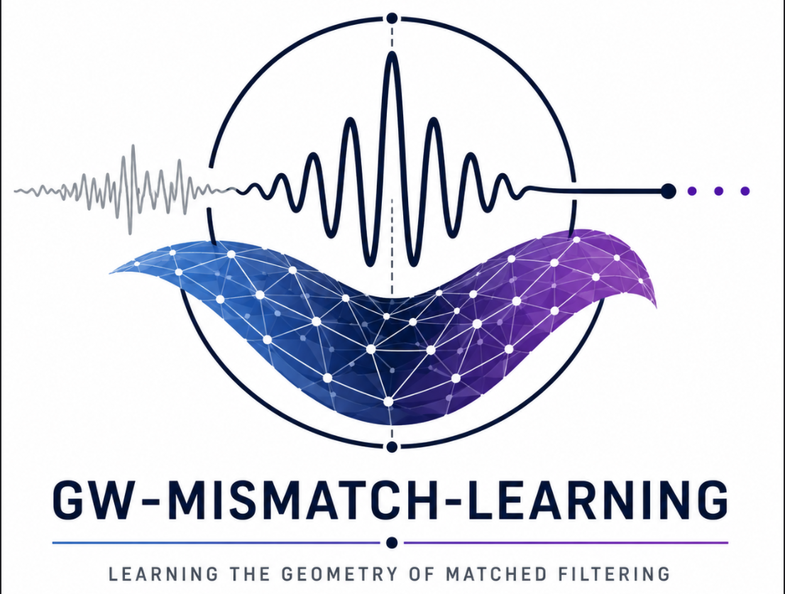

# gw-mismatch-learning

`gw-mismatch-learning` investigates whether the geometry induced by matched filtering can be learned as a latent representation for gravitational-wave waveforms. Rather than replacing matched filtering, this project learns coordinates in which distance approximates waveform mismatch, enabling geometry-aware search, template retrieval, and hierarchical matched-filter experiments using standard GW analysis tools.

## Scientific framing

Matched filtering defines waveform similarity through the noise-weighted overlap. Mismatch, defined as `1 - match`, induces a geometry on waveform space. This repository learns an embedding `z = f(h)` such that distances in latent space approximate the mismatch geometry.

The learned geometry is intended to support nearest-neighbor retrieval, candidate reduction, and hierarchical matched-filter search. Exact matched filtering remains the final verification step.

## Current status

The repository has completed its first real-waveform validation milestone. A learned latent representation has been trained and evaluated on nonspinning `IMRPhenomD` waveform banks using PyCBC/LALSuite matched-filter mismatch as the ground-truth distance.

In the Phase 3 validation sweep, learned latent nearest-neighbor retrieval outperformed naive Euclidean retrieval in raw `(m1, m2)` space across five random seeds, bank sizes 128 through 1024, and retrieval metrics at `K = 5, 10, 20`. This demonstrates neighborhood preservation for the tested compact nonspinning banks only. It does not establish search acceleration, production-scale performance, or generalization to spin, precession, eccentricity, other waveform families, or broader parameter spaces.

See `docs/pipeline_milestones/phase3.md` and `docs/pipeline_milestones/phase3_validation_results.md` for the frozen pipeline milestone snapshot and reproducibility notes. Paper-oriented validation studies are tracked under `docs/paper_validation/`.

## What this repo is not

- Not a replacement for matched filtering.
- Not a new waveform model.
- Not a production search pipeline yet.

## Installation

For lightweight development without full gravitational-wave dependencies:

```bash
python -m venv .venv
source .venv/bin/activate
pip install -e ".[dev]"
```

For GW waveform generation and overlap calculations, use an isolated environment. PyCBC/LALSuite pin parts of the scientific stack, including `scipy<1.17`, and may conflict with unrelated packages installed in a shared user Python.

```bash
python -m venv .venv-gw
source .venv-gw/bin/activate
pip install -e ".[gw]"
```

The requirements-file equivalent is:

```bash
pip install -r requirements-gw.txt
```

PyCBC and LALSuite installation can be platform-dependent, so the core package and synthetic smoke tests avoid importing them unless a GW-specific function is called.

If `pip check` reports an unrelated `pyopenssl`/`cryptography` conflict after installing GW extras into a shared user Python, create a fresh virtual environment for this project. The repository does not use those packages directly; the conflict comes from mixing GW dependencies with other packages already present in the Python environment.

## Smoke test

Run the synthetic mismatch-geometry smoke test:

```bash
python scripts/train_embedding.py --config configs/training.yaml
pytest
```

The smoke path generates mock vectors, defines a toy mismatch distance, trains a small encoder to preserve pairwise distances, and evaluates retrieval metrics.

## Planned workflow

1. Mock geometry: synthetic vectors, toy mismatch distances, learned embeddings, retrieval evaluation.
2. Standard waveform bank: PyCBC/LALSuite waveform generation, HDF5 storage, sampled match/mismatch computation.
3. Retrieval experiment: encode a bank, retrieve top-K latent candidates, and compare against brute-force exact matching.

## Design principles

- Keep GW physics standard.
- Keep ML contribution isolated and testable.
- Treat exact matched filtering as ground truth.
- Evaluate candidate reduction before claiming runtime speedup.
- Use reproducible configs for all experiments.
- Avoid committing large generated files.

## Data policy

Generated waveform banks, mismatch matrices, trained models, and experiment outputs are intentionally excluded from git. Use `data/`, `models/`, and `outputs/` for local artifacts.
